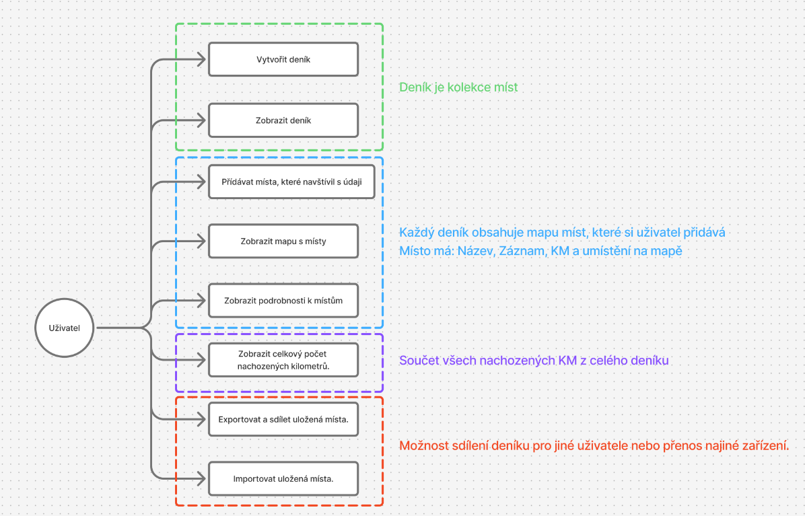
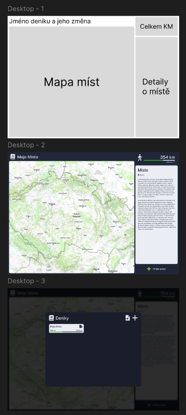
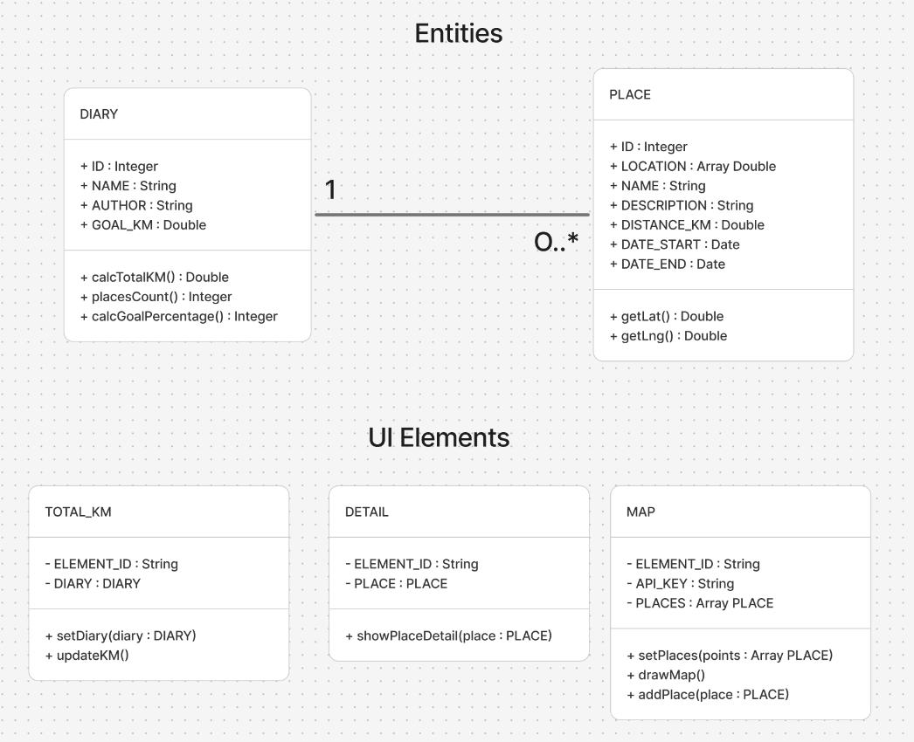

# Cestovatelský deník

## 1. Funkční specifikace

Aplikace bude sloužit k zaznamenávání míst, textu a počtu nachozených kilometrů z výletu.

Jedna kolekce míst se v aplikaci bude nazývat deník a uživatel ho bude moct exportovat a poslat dalším lidem.

### UseCase diagram

Návrh diagramů v programu FigJam: [https://www.figma.com/board/J8zs0yoSv4JbrZ9QYQ2vBo/WWW-Aplikace?node-id=10-62&t=H6936eJWyFUkEArJ-1](https://www.figma.com/board/J8zs0yoSv4JbrZ9QYQ2vBo/WWW-Aplikace?node-id=10-62&t=H6936eJWyFUkEArJ-1)

### Specifikace uživatelských rolí

V aplikaci se nachází pouze jedna role, která dokáže vše podle UseCase diagramu.

### Grafický návrh aplikace

Návrh v programu Figma: [https://www.figma.com/design/tODsBuWfOf6cNPQ1Y5AyXm/N%C3%A1vrh-webu-pro-WWW-aplikace?node-id=0-1&t=H6936eJWyFUkEArJ-1](https://www.figma.com/design/tODsBuWfOf6cNPQ1Y5AyXm/N%C3%A1vrh-webu-pro-WWW-aplikace?node-id=0-1&t=H6936eJWyFUkEArJ-1)

UI se bude skládat ze 4 hlavních částí (viz. první návrh):
1. Jméno deníku a jeho změna \
Bude ukazovat název a po kliknutí se otevře nabídka (viz. třetí návrh), kde se bude moc vybrat deník, do kterého se budeme chtít podívat, vytvořit nový deník (tlačítko plus) nebo ho exportovat (tlačítko se šipkou u souboru u daného deníku)/importovat (tlačítko se šipkou u souboru vedle tlačítka plus).

2. Mapa míst \
Ukáže mapu všech míst, které jsou uložené v daném deníku, po kliknutí na specifické místo se zobrazí detaily v pravém boxu.

3. Celkem KM \
Ukáže nám celkový nachozený počet kilometrů v celém deníku a i progres podle námi nastaveného cíle.

4. Detaily o místě \
Ukáže nám název, popis a počet nachozených kilometrů o specifickém místě, které vybereme na mapě.

## 2. Technická specifikace

### Class diagram

Návrh diagramů v programu FigJam: [https://www.figma.com/board/J8zs0yoSv4JbrZ9QYQ2vBo/WWW-Aplikace?node-id=10-62&t=H6936eJWyFUkEArJ-1](https://www.figma.com/board/J8zs0yoSv4JbrZ9QYQ2vBo/WWW-Aplikace?node-id=10-62&t=H6936eJWyFUkEArJ-1)

### Technologie

Pro vykreslení mapy a práci s ní budu využívat knihovnu MapLibre ([https://maplibre.org/](https://maplibre.org/)) a pro dlaždice budu využívat Mapy.com ([https://developer.mapy.com/](https://developer.mapy.com/)).

Pro lokální ukládání dat budu využívat Indexovanou databázi v prohlížeči.

Pro ikony budu využívat knihovnu/databázi Font Awesome ([https://fontawesome.com/](https://fontawesome.com/)).
